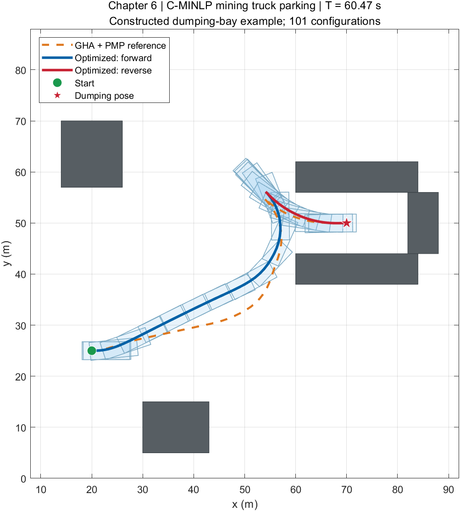
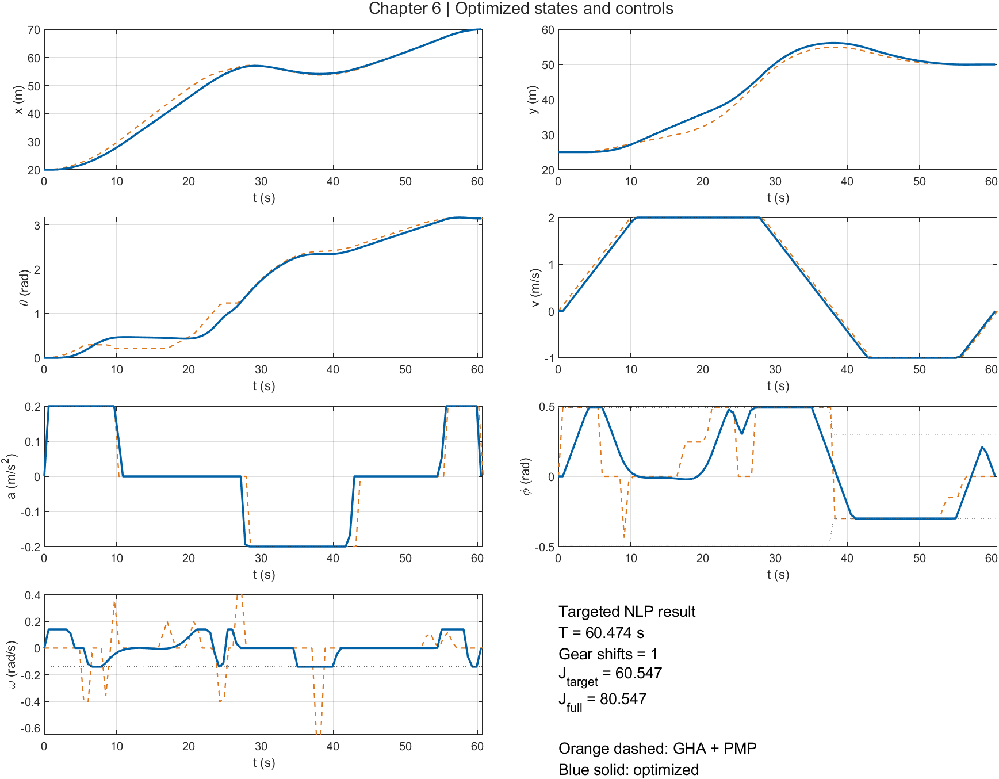
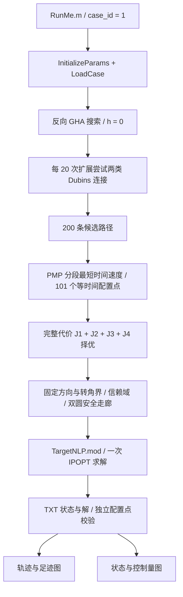

# C-MINLP2023 — 第六章配套 MATLAB 示例

本仓库配套**中文图书《非结构化场景自动驾驶轨迹规划技术》**第六章：**露天矿区装卸载场景中的矿用货车精准停泊轨迹规划方法**。

书名英文译名为 *Trajectory Planning Techniques for Autonomous Driving in Unstructured Environments*；这里提供译名便于国际读者理解，图书本身为中文版。

建议结合本章与下列论文阅读代码。该示例依据论文重新实现，采用一个自建卸载泊位；不是论文作者原始学生代码，也不是论文中的 20 个基准场景。

> Bai Li, Yakun Ouyang, Xiaohui Li, Dongpu Cao, Tantan Zhang, and Yaonan Wang. **Mixed-Integer and Conditional Trajectory Planning for an Autonomous Mining Truck in Loading/Dumping Scenarios: A Global Optimization Approach.** *IEEE Transactions on Intelligent Vehicles*, 8(2):1512–1522, 2023. [DOI: 10.1109/TIV.2022.3214777](https://doi.org/10.1109/TIV.2022.3214777).

**使用本代码进行研究、实验或发表成果时，请引用该论文。** 论文于 2022 年在线发表，正式卷期为 2023 年。BibTeX 见 [CITATION.bib](CITATION.bib)。

## 实际运行效果

运行 `matlab/RunMe.m`，从头计算并生成且只生成以下两张静态图。图像来自本仓库实际求解结果。

**轨迹与足迹：** 橙色虚线为 GHA + PMP 初始轨迹；蓝色和红色分别为优化后的前进、倒车轨迹。先绘制浅色最优足迹，再绘制轨迹，避免足迹遮挡曲线。



**状态与控制量：** 展示 `x, y, theta, v, a, phi, omega`，并标注速度、加速度、转角、转角速度限幅。



默认例子采用论文表 I 参数，搜索 200 条候选路径，进行一次目标 NLP 求解。已在 Windows、MATLAB R2021b、Navigation Toolbox、IPOPT 3.13.4 / MA27 上验证：总时间约 **60.474 s**，**1 次换挡**，目标 NLP 代价约 **60.547**，完整 C-MINLP 代价约 **80.547**。详细数值与验证记录见 [docs/VALIDATION.md](docs/VALIDATION.md)。

## 安装与一键运行

### 1. MATLAB

安装 **MATLAB R2021b 或更高版本**及 **Navigation Toolbox**。GHA 的两类 Dubins 连接使用 MathWorks 的 [`dubinsConnection`](https://www.mathworks.com/help/nav/ref/dubinsconnection.html)。本示例不需要 Optimization Toolbox、AMPL MATLAB API、Python 或 CasADi。

### 2. AMPL 与 IPOPT 可执行程序

从 [AMPL 官方下载入口](https://portal.ampl.com/account/ampl/) 获取适用于本机的 AMPL 和 IPOPT 包，按 [官方安装说明](https://ampl.com/ampl-install-guide/) 完成安装与许可证激活。需要能处理本例规模的 AMPL 许可证；受变量数量限制的试用版可能无法求解。IPOPT 的下载与配置见 [官方 IPOPT 页面](https://dev.ampl.com/solvers/ipopt/index.html)。

Windows 下可将合法取得的 `AMPL.exe`、`ipopt.exe` 及其依赖 DLL 放入 `matlab/`。不要混用不同发行包的 DLL。也可以把求解器目录加入系统 `PATH`，并在 MATLAB 中指定 AMPL 路径，例如：

```matlab
setenv('AMPL_EXECUTABLE', 'C:\AMPL\ampl.exe');
setenv('PATH', ['C:\AMPL;', getenv('PATH')]);
```

`AMPL_EXECUTABLE` 只填写文件路径，不附加引号或命令参数。程序优先使用这个环境变量；未设置时先查找本地 `AMPL.exe`，否则使用 `PATH` 上的 `ampl`。`ipopt` 也应能够被 AMPL 找到。

`matlab/ipopt.opt` 默认使用论文中的 `linear_solver ma27`。若所安装的 IPOPT 不含 MA27，请将该行改为安装包支持的线性求解器，例如 `linear_solver mumps`。这只改变线性方程求解后端，目标函数和约束不变。可用后端取决于 IPOPT 构建，见 [IPOPT 官方选项说明](https://coin-or.github.io/Ipopt/OPTIONS.html#OPT_linear_solver)。本仓库记录的数值验证使用 MA27；其他构建未在本示例发布时测试。

第三方可执行文件、DLL 和许可证不随仓库发布。程序使用原有的文件通信方式：**MATLAB 写参数 → AMPL 执行 `.run` → IPOPT 求解 → 写 TXT → MATLAB 读取求解状态和结果**。

### 3. 运行

在 MATLAB 中打开 `matlab/RunMe.m`，点击 **Run**。或在克隆后的仓库目录执行：

```matlab
run('matlab/RunMe.m');
```

默认 `case_id = 1` 是本版唯一的自建场景。更换场景时修改 `LoadCase.m` 的起终位姿、作业边界和矩形障碍物。每次运行都重新搜索、重新求解，不读取预存轨迹冒充计算结果。

运行后：

- 屏幕显示两张图，工作区 `demo` 保存初始解、优化解、搜索统计和校验结果。
- `docs/images/trajectory.png` 与 `profiles.png` 更新为此次运行效果。
- `matlab/AmplInputs/` 保存本次参数、初值；`matlab/AmplResults/` 保存 TXT 结果、`solver.log`、`validation.json` 和 `demo_result.mat`。
- 这两个通信目录以 `.gitkeep` 保留；运行数据不提交到 Git。

## 总体架构



这里实现论文的 **GHA → PMP → targeted NLP** 流程。精修阶段的运动学和双圆几何关系均为硬等式，不使用第五章 LIOM 的迭代软约束罚函数。

## 论文参数

| 参数 | 默认值 | 含义 |
|---|---:|---|
| `LF, LW, LR, LB` | 1.71, 5.73, 1.90, 3.50 m | 前悬、轴距、后悬、车宽 |
| `vmin, vmax` | −1.0, 2.0 m/s | 倒车与前进速度界 |
| `amax` | 0.2 m/s² | 加速度绝对值上界 |
| `Phi_max, Omega_max` | 0.49 rad, 0.14 rad/s | 转角、转角速度界 |
| `gamma` | 0.6122 | 倒车转角界缩放系数 |
| `Lac, Lbm` | 5 m, 30 m | 相邻尖点距离阈值、长倒车惩罚阈值 |
| `w1, w2, w3, w4` | 1, 0.025, 20, 1 | 完整代价的权重 |
| `Nfp` | 200 | GHA 候选路径数 |
| `Nfe` | 100 | 时间区间数，即 **101 个配置点** |

数值配置集中在 `InitializeParams.m`。论文未指定的演示设置单独列在该文件后半部分，包括：`beta = 5 m`、搜索步长与网格分辨率 `2.5 m`、角度网格 `2π/48`、每方向 5 个转角样本、路径采样步长 `0.5 m`、走廊扩张步长 `0.25 m` 和每边最大扩张 `5 m`。120000 次搜索扩展和 180 s IPOPT CPU 上限仅为失败退出保护，不作为求解成功标准。

## 与论文、书中内容的对应

- 式 (2)：采用前向 Euler 离散，`dt = T/100`；所有 101 个配置点的状态、控制和端点条件按模型求解。
- 式 (3)：速度、加速度、转向及转向速率限幅。**论文印刷式 (3b)、(13) 把较小转角界写在 `v >= 0` 分支，但紧随其后的文字和 Fig. 3 要求倒车曲率更小。** 本实现采用论文文字、Fig. 3 和书中式 (6-1) 的一致含义：前进上界为 `0.49`，倒车上界为 `0.6122 × 0.49`。
- 式 (4)–(5)：搜索对短换挡段加罚，并筛除不满足距离要求的候选路径。按书中尖点说明，把起终点也作为段边界；本例所有恒方向段均检查不少于 5 m。数值统计忽略 `|v| < 1e-6` 的零速点，再计实际方向变化，避免停驻点导致漏计。
- 式 (6)：起终位姿固定，且两端 `v, a, phi, omega` 全部为零。本例采用论文的静止起终条件。
- 式 (7)：用覆盖矩形车体的前后两圆建立固定安全走廊。圆覆盖保守地保证车体避障；校验仅针对离散配置点，不加入相邻点间扫掠碰撞模型。
- 式 (8)–(9)：候选解按 `J = T + 0.025*sum(a.^2 + v.^2.*omega.^2) + 20*换挡次数 + 长倒车平方罚项` 排序。`J2` 按论文求和，**不额外乘 `dt`**；`J4` 为每段倒车长度超过 30 m 部分的平方和。
- Algorithm 1 / IV-B：交换起终点、始终 `h = 0`、每 20 次扩展尝试两条不同转弯半径的 Dubins 连接，找到 200 条候选后择优。搜索时的行驶方向与实际执行方向相反，曲率界随之对调。PMP 给每个恒方向路径段分配静止到静止的加速—巡航—减速或加速—减速速度。
- 式 (11)–(14)：从初始轨迹固定各点方向及对应转角界，施加位置邻域和安全走廊；求解一次硬约束 NLP，目标仅保留 `w1*J1 + w2*J2`。严格的倒车不等式在数值模型中用闭区间 `v <= 0` 表示。求解后独立检查方向模式与段长，不能仅凭求解器成功就宣称通过。

本版按用户指定的论文作为技术细节依据：不混入书中其他扩展配置（非零初速、终端位姿区间、延迟启用启发函数、铲斗条件几何等）。场景选为**卸载泊位**，没有挖掘机铲斗，因此不另加装载铲斗避障条件。搜索罚项的具体数值与网格离散是独立实现的工程选择，不声称与未公开原代码相同。有限候选搜索和一次局部 NLP 的成功，不构成连续原问题全局最优性的数学证明。

## 主要文件与函数

| 文件 | 功能 |
|---|---|
| `matlab/RunMe.m` | 一键入口；书籍、论文引用说明；选择 `case_id` |
| `RunMiningTruckDemo.m` | 串联搜索、走廊、NLP、验证和两张图，返回 `demo` |
| `InitializeParams.m` | 论文表 I 参数与单独标注的演示数值设置 |
| `LoadCase.m` | 自建卸载场景、作业边界、起终位姿、矩形障碍物 |
| `SearchGlobalHybridAStar.p` | GHA 搜索、方向相关曲率、双 Dubins 连接和 200 候选择优；P-code |
| `PlanReferenceVelocity.m` | 各恒方向段的 PMP 时间最优速度与等时间采样 |
| `EvaluateTrajectoryCost.m` | 计算完整四项代价、目标 NLP 代价、换挡数与各段长度 |
| `CheckPoseCollision.m` | 计算指定配置点的双圆净空，检查圆与场景边界及矩形障碍物 |
| `BuildSafeTravelCorridors.m` | 在无碰撞空间中扩张双圆圆心的矩形走廊，精修期间保持固定 |
| `WriteTargetNLPData.m` | 输出参数、走廊、方向、转角界及初值供 AMPL 读取 |
| `TargetNLP.mod` | 可读的目标 NLP 模型：硬 Euler 等式、硬几何等式、端点及变量界 |
| `SolveTargetNLP.run` | AMPL 命令文件，调用 IPOPT，输出状态及 TXT 变量 |
| `SolveTargetNLP.m` | 清除本程序旧 TXT，调用可执行文件，检查成功标志并读取结果 |
| `ValidateSolution.m` | 独立验证等式、端点、限幅、信赖域、走廊、离散避障、方向模式和段长 |
| `CreateVehiclePolygon.m` | 根据后轴中心与航向生成车身矩形，沿用配套代码的函数风格 |
| `DrawResults.m` | 只生成轨迹足迹图与状态控制图，并导出 README 图片 |
| `ipopt.opt` | IPOPT 容差、停止上限及线性求解器设置 |

表中未写前缀的算法文件都在 `matlab/`。无动画、视频导出、临时测试命名文件或历史结果文件夹。

## P-code 与发布范围

GHA 核心以 `SearchGlobalHybridAStar.p` 发布，目录中不含同名 `.m`。P-code 在 MATLAB R2021b 生成；用户正常调用函数即可。参数、模型、文件通信、验证和静态绘图代码保持可读，以便理解论文和调整场景。P-code 的运行与兼容性说明见 [MathWorks 文档](https://www.mathworks.com/help/matlab/ref/pcode.html)。

本仓库含受保护的 P-code，因此是**部分源码公开的教学配套代码**；不把它标注为全部源码开放。原始受保护源码由维护者在发布目录之外留存。论文、书稿、第三方软件及其许可证不包含在仓库内。

## 常见问题

| 现象 | 检查方式 |
|---|---|
| 缺少 `dubinsConnection` | 安装并启用 Navigation Toolbox |
| 无法启动 AMPL 或找不到 `ipopt` | 检查可执行文件位置、`AMPL_EXECUTABLE`、`PATH` 和 DLL 是否来自同一发行包 |
| AMPL 提示规模或许可限制 | 按官方安装说明激活适用许可证 |
| `ma27` 不可用 | 在 `ipopt.opt` 中选用该 IPOPT 构建支持的后端 |
| NLP 未收敛或状态不是成功 | 阅读 `AmplResults/solver.log`；程序不会绘制旧解冒充此次成功 |
| 修改场景后找不到 200 条路径 | 检查起终车体是否可行、空间与转弯半径、搜索分辨率和扩展上限；程序会明确报错 |
| 修改地图为任意多边形 | 当前演示明确使用矩形障碍物；须同时修改碰撞检测及走廊判定，不能只改绘图 |
